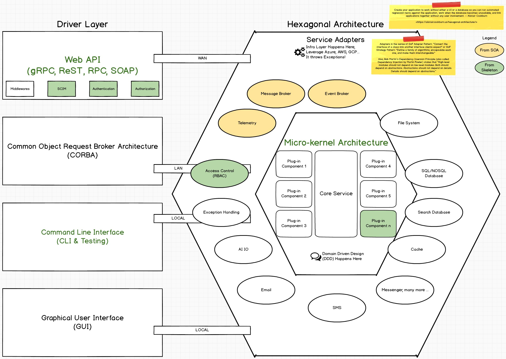
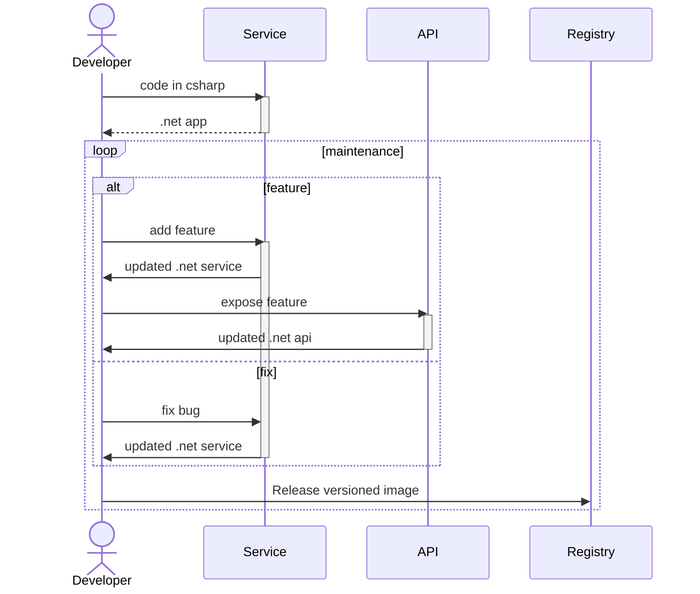

# API Skeleton

Welcome to the `skeleton-api-dotnet` repository! This repository provides a bootstrapping script to kickstart your C# API project with an array of pre-configured, opinionated features that align with modern best practices for identity management, security, and architecture. Our goal is to simplify API development, ensuring scalability, security, and maintainability.

The framework uses a Hexagonal Architecture (also known as Ports and Adapters), which promotes a clear separation between the domain logic and the outside world, making it easier to test and maintain. The service core interacts with adapters for messaging, events, databases, and other services.

## Primary Objective

The primary objective of this project is to provide a streamlined development process that results in a containerized API application, ready for deployment to container registries such as Azure Container Registry (ACR), Amazon Elastic Container Registry (ECR), or any similar container repository.

This ensures that your API is packaged, versioned, and prepared for seamless deployment into any cloud or on-premise environment, enabling efficient scaling, updating, and orchestration through Kubernetes or other container management platforms.

Here’s a summary of the layers and components included:
* **Driver Layer**: Interfaces like Web APIs (gRPC, REST, RPC, SOAP), CORBA, CLI, and GUI for interaction with the service.

* **Hexagonal Core**: Service adapters for low level implementation (Azure, AWS, GCP) and a central micro-kernel architecture that includes a core service and plug-in components.

### Key Features

* **SCIM for Identity Management**  
We integrate SCIM (System for Cross-domain Identity Management) for handling identity management in a standardized way, simplifying user provisioning and lifecycle management across platforms.

* **REST API Standard**  
The API follows standard REST principles for resources defined at [RFC7643](https://datatracker.ietf.org/doc/html/rfc7643#page-13), making it interoperable with other systems and predictable for developers familiar with RESTful services.

* **OIDC for Authentication**  
For authentication, we use OpenID Connect (OIDC), built on top of OAuth2, to ensure secure and scalable identity verification and token exchange.

* **OAuth2 for Authorization**  
Authorization is handled using OAuth2, allowing granular access to resources, third-party authorization, and integration with major identity providers.

* **RBAC for Access Control**
The framework uses Role-Based Access Control (RBAC) to manage permissions within the system, ensuring that users have access only to the resources they need based on their roles.

* **Micro-Kernel Architecture**
The Service is built on a micro-kernel architecture, allowing you to extend and customize the core services with plug-ins. This ensures flexibility and modularity, making it easy to add or remove components as your system evolves.

* **Middleware Filters**
The API leverages several middleware components from the middlewares-dotnet project.

## Getting Started

### Prerequisites

TODO: Write

> **IMPORTANT NOTE FOR WINDOWS:** Git has a limit of 4096 characters for filename, but, on windows, the default limit is 260 (because of an older Windows API compatibility). In order to fix `Filename too long`, you must execute `git config --system core.longpaths true` before cloning this repository.
> 
> **IMPORTANT NOTE FOR WINDOWS:** Linux containers shell scripts don't work when git changes the line endings of the shell files to crlf. In order to avoid shell scripts not working, you must execute `git config --global core.autocrlf false` before cloning this repository.
> 

### Installation

TODO: Write

### Running the Project

TODO: Write

### Daily Developer Experience (DX)

### Standards & Rules

To maintain consistency, scalability, and interoperability within the project, it is crucial to follow our established standards and rules for data handling, storage, and runtime configurations. These standards ensure smooth integration between services, ease of debugging, and clarity for all developers.

| Context                                |                            Specification                             |
|:---------------------------------------|:--------------------------------------------------------------------:|
| Storing and Sharing **Date and Time**  | [ISO 8601 Z](https://www.iso.org/iso-8601-date-and-time-format.html) |
| Storing and Sharing **Country Codes**  |     [ISO 3166](https://www.iso.org/iso-3166-country-codes.html)      |
| Storing and Sharing **Language Codes** |     [ISO 639-1](https://www.iso.org/iso-639-language-codes.html)     |
| Storing and Sharing **Currency Codes** |     [ISO 4217](https://www.iso.org/iso-4217-currency-codes.html)     |
| Runtime **Charset**                    |                            UTF-8 (65001)                             |
| Runtime **Language Code**              |                             en-US (1033)                             |

Adhering to these specifications is critical in ensuring compatibility across systems and making the Service both internationalized and ready for diverse integration environments.
